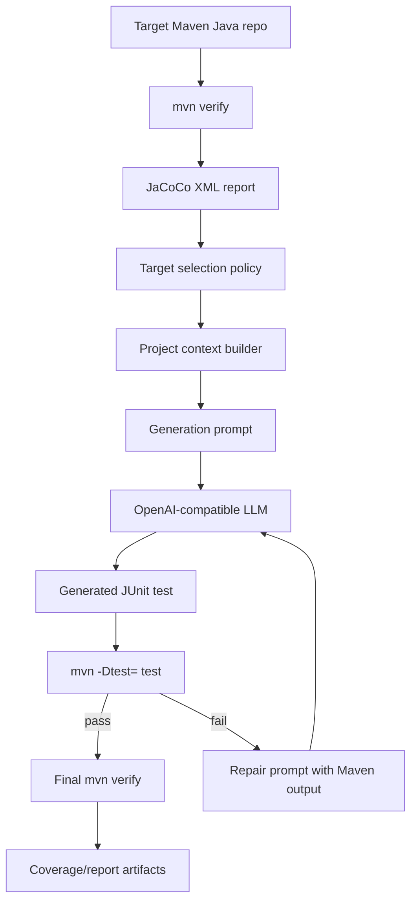

# Architecture

JTestGen is a small AI engineering system around a Java test-generation loop. The LLM is deliberately not the whole product: coverage analysis, target selection, prompt construction, deterministic verification, repair, and observability all sit around it.

## System Loop



## Components

| Component | Responsibility |
| --- | --- |
| `coverage.py` | Parse JaCoCo project and class-level line coverage. |
| `targeting.py` | Rank low-coverage classes and skip poor generation targets such as interfaces, abstract classes, generated sources, and inner classes. |
| `java_source.py` | Discover Java source files and map JaCoCo classes back to source. |
| `context.py` | Collect generation rules, nearby sample tests, existing generated tests, and inferred test package. |
| `prompting.py` | Build versioned generation and repair prompts. |
| `generator.py` | Call an OpenAI-compatible API or deterministic file-backed generator. |
| `runner.py` | Execute Maven verify and generated-test commands. |
| `workflow.py` | Orchestrate baseline coverage, generation, repair loop, final coverage, and status handling. |
| `reporting.py` | Persist run artifacts, prompt snapshots, Maven logs, generated revisions, and `report.json`. |

## Prompt Strategy

Generation prompts include:

- target class name, generated test path, inferred test package
- current class coverage from JaCoCo
- project rules
- production source
- nearby sample tests
- output contract that forbids Markdown, diffs, build edits, and invented dependencies

Repair prompts include:

- exact Maven command that failed
- current generated test
- Maven output
- failure taxonomy: compile errors, missing imports, test discovery, checked exceptions, assertion failures, mocking issues, runtime exceptions
- instructions to make the smallest coverage-preserving correction

Prompt versions are recorded in each run report:

```json
{
  "prompt_versions": {
    "generation": "generation-v3",
    "repair": "repair-v3"
  }
}
```

## Observability

Each run creates:

```text
.jtestgen/runs/<run-id>/
  report.json
  prompt.initial.system.txt
  prompt.initial.user.txt
  prompt.repair.<n>.system.txt
  prompt.repair.<n>.user.txt
  maven.baseline.log
  maven.test.<n>.log
  maven.final.log
  generated.initial.java
  generated.repair.<n>.java
  generated.final.java
```

This makes the model interaction debuggable and reproducible.

## Evaluation

The deterministic eval harness uses a tiny Maven fixture and a file-backed mock generator:

```powershell
python evals/run_eval.py --maven-command C:\tmp\apache-maven-3.9.11\bin\mvn.cmd
```

It includes two deterministic scenarios:

- `tiny-success`: the first generated test compiles and improves coverage.
- `tiny-repair-needed`: the first generated test fails compilation, then the repair response fixes it.

The eval checks that the orchestration loop can:

- run baseline JaCoCo coverage
- select a target class
- apply generated test code
- run Maven verification
- produce final coverage deltas
- write report artifacts

## Current Scope

Supported today:

- Maven single-module projects
- JUnit-style test generation
- JaCoCo XML at `target/site/jacoco/jacoco.xml`
- OpenAI-compatible chat completion APIs
- deterministic file-backed eval generator

Not yet supported:

- Gradle projects
- Maven multi-module source/test mapping
- automatic build-file dependency edits
- patch-only mode
- semantic coverage attribution beyond JaCoCo line counters
